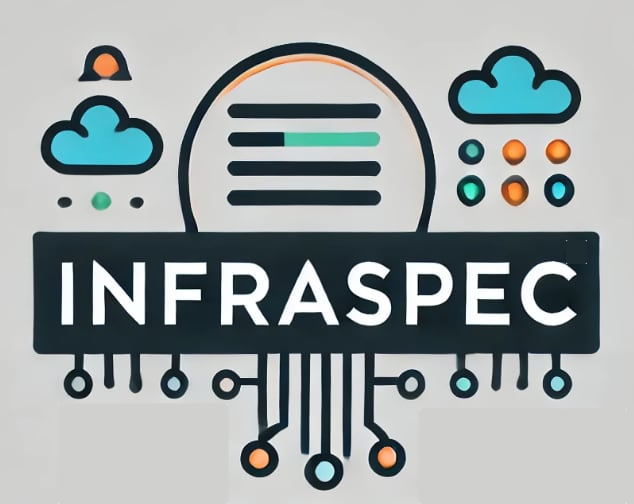

<div align="center">
<h1 align="center">

</h1>
<h3>Write infrastructure tests in plain English, without writing a single line of code.</h3>
</div>

# InfraSpec

Write infrastructure tests in plain English using [Gherkin](https://cucumber.io/docs/gherkin/) syntax, without writing
code. InfraSpec translates your natural language specifications into executable infrastructure tests.

```gherkin
Feature: S3 Bucket Creation
  As a DevOps Engineer
  I want to create an S3 bucket with guardrails
  So that I can store my data securely

  Scenario: Create an S3 bucket with a name
    Given I have a Terraform configuration in "./s3-bucket"
    And I set variable "bucket_name" to "my-bucket"
    When I run Terraform apply
    Then the S3 bucket "my-bucket" should exist
    And the S3 bucket "my-bucket" should have a versioning configuration
    And the S3 bucket "my-bucket" should have a public access block
    And the S3 bucket "my-bucket" should have a server access logging configuration
    And the S3 bucket "my-bucket" should have a encryption configuration
```

:warning: This project is still under heavy development!

Under the hood, InfraSpec executes scenarios using [GoDog](https://github.com/cucumber/godog) and leverages testing
modules from [Terratest](https://terratest.gruntwork.io/).

## Features

- Write tests in plain English using Gherkin syntax
- Supports AWS infrastructure testing
- Integrates with Terraform configurations
- Zero code required for writing tests

## Status

At the moment, only a subset of AWS infrastructure is supported, but over time we hope to support other clouds and
tooling.

| **Product** | **Description** |  **Status**  |
| ------------- | ------------- | ------------- |
| API Gateway | Not Implemented  | ⏳ |
| DynamoDB | Partially Supported  | ✅ |
| ElastiCache | Not Implemented | ⏳ |
| RDS Aurora | Not Implemented  | ⏳ |
| S3 | Not Implemented  | ⏳ |


## Why InfraSpec?

- **Natural Language Testing.** Write tests in plain English that both technical and non-technical team members can understand.
- **LLM Integration.** Leverage AI to generate test scenarios.
- **Supply Chain Security.** Ensure your infrastructure meets security and compliance requirements.
- **No Code Required:** Focus on what to test rather than how to test.

## Installation

```sh
go install github.com/robmorgan/infraspec@latest
```

## Getting Started

If your using VS Code, we recommend installing the [Cucumber (Gherkin) Full Support](https://marketplace.visualstudio.com/items?itemName=alexkrechik.cucumberautocomplete)
extension for syntax highlighting.

## Contributions

Contributions are welcome! Please open an issue or submit a pull request. Please note, that this project is still in
it's infancy and many internal APIs are likely to change.
